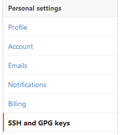
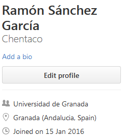
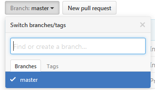

##Practica 0: Git y Github  
###Autor: Ramón Sánchez García  
  
Primera práctica realizada como introducción al curso, donde se practica con las herramientas que vamos a utilizar a lo largo de este.

###Tareas realizadas  
  
##**Creación de par de claves y subida de clave a Github.**  

**En Linux**: A través de comandos podemos generar una clave  y registrarla en nuestro perfil de Github. Para ello en una ventana he utilizado el comando:  
```ssh-keygen -t rsa -C "correo@correo.es"```  
Dónde *correo@correo.es* es el correo que deseemos registrar. En mi caso utilizaré el de mi cuenta. 
   
Con esto hemos generado la clave, ahora debemos exportarla, para ello buscamos el archivo **id_rsa.pub** que normalmente está dentro del directorio **/home/usuario/.ssh**, donde *usuario* es el nombre de nuestro perfil de Ubuntu.  
Abrimos el fichero, copiamos la clave que este tendrá y la añadimos en el apartado de configuración > SSH de Github: 
 
  

**En Windows**: Necesitaremos una interfaz de comandos para Git, como puede ser MSysGit. Desde ella utilizamos la orden ```ssh-keygen```. Nos preguntará que le indiquemos el ficheron donde se guardará la clave (como el archivo **id_rsa.pub** en el caso de Linux), y por una passphrase, siendo esta optativa. Si todo ha ido bien, se habrá generado la clave en ese archivo, un aviso por pantalla debería mostrarlo. La exportación de la clave a Github es igual que los del apartado anterior.  
  
##**Configuración correcta del nombre y correo electrónico para que aparezca en los commits.**  

Para que, a la hora de realizar algún commits, aparezca nuestro usuario y/o correo, se recomienda realizar la configuración del nombre y del correo. Para ello:  
  
* Caso del nombre:  
```git config --global user.name "Ramon Sanchez Garcia"```
* Caso del correo:  
```git config --global user.email "chenteuni@gmail.com"````  
  
**Nota:** Como se observa, he utilizado mi nombre y mi correo, que cada uno utilice el suyo.  
**Nota 2:** Si es la primera vez que utilizas git, muy probablemente, a la hora de realizar el primer commit, te diga que estos parámetros no están configurados, por lo que al final acabas configurándolos sí o sí.
  
##**Edición del perfil para que aparezca nombre completo y ciudad, así como universidad.**  
  
Si a la hora de crear el perfil se nos ha olvidado añadir datos, nos hemos equivocado, o simplemente ha pasado el tiempo y queremos cambiar datos de nuestro perfil, lo que tenemos que hacer es ir a nuestra página de github, y seleccionar la opción **Edit Profile**.  
  
  

  
En él podemos editar nuestro nombre, organización, web, etc.  

##**Otros objetivos**  
Aunque no están indicados exactamente, estos objetivos se piden en si en el desarrollo de esta práctica:  

* **Creación de Branch:**  
Necesitamos crear un *Branch* o *rama* para subir este primera práctica. Para ello, desde nuestro repositorio, pulsamos el botón ```Branch: Master```, y nos indicará que desde ahí podemos buscar o crear un Branch. Crearemos uno nuevo llamado *hito0*:  
  
  

Ahora a través de comandos, subimos este archivo a esa rama, para ello utilizamos los siguientes comandos:  
```git checkout -b hito0``` Cambiamos a la rama "hito0", originalmente empezamos en "master".  
```git add hito0.md``` Añadimos el archivo  
```git commit -a -m "closes #0"``` Una descripción de la subida, normalmente se puede indicar con "closes #numero", donde "numero" es el numero de subida.  
```git push origin hito0``` Indicamos que queremos que se suba el archivo a esta rama. 

* **Repositorio compartido**  

La asignatura cuenta con un repositorio de Github en el que colaboramos todos los alumnos. En primera intancia necesitamos tener una "copia", para ello ejecutamos ```git clone repositorio``` donde "repositorio" es un enlace de dicho repositorio. Si hemos realizado el fork, ahora quedaría hacer el pull request con los cambios que nosotros realicemos.  

Bibliografía: [Git SCM, comandos y ayuda con Git](https://git-scm.com/Comandos Git)  


 
